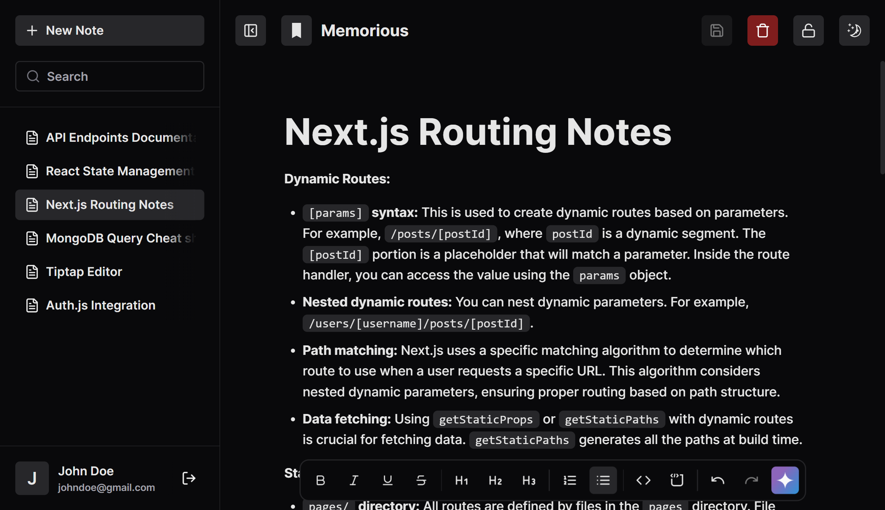

# Memorious

Memorious is a note-taking solution built on Next.js. It provides a clean space to capture ideas, harness modern AI features, and stay organized. Designed for efficiency and convenience, it makes managing your information seamless and straightforward.

## Features

### 🚀 Core Features

- **Rich Text Editor**: Powered by Tiptap, supporting markdown, bullet points, ordered lists, and text styling
- **AI Integration**: Leveraging Google's Generative AI for smart features
- **Real-time Updates**: Seamless and responsive user experience
- **Dark/Light Mode**: Built-in theme support using next-themes
- **Authentication**: Secure user authentication with NextAuth.js

### 💡 Smart Features

- **Advanced Search**: Fast and fuzzy search capabilities using Fuse.js
- **Markdown Support**: Write and preview markdown with markdown-it
- **Responsive Design**: Beautiful UI components from Shadcn UI
- **Performance Monitoring**: Integrated Vercel Speed Insights

## Tech Stack

- **Framework**: Next.js 14 with TypeScript
- **Database**: Prisma ORM
- **UI Components**:
  - Shadcn UI, Radix UI primitives
  - TailwindCSS for styling
- **Authentication**: NextAuth.js
- **Editor**: Tiptap
- **AI**: Gemini 1.5 Flash-8B

## License

This project is private and proprietary.
