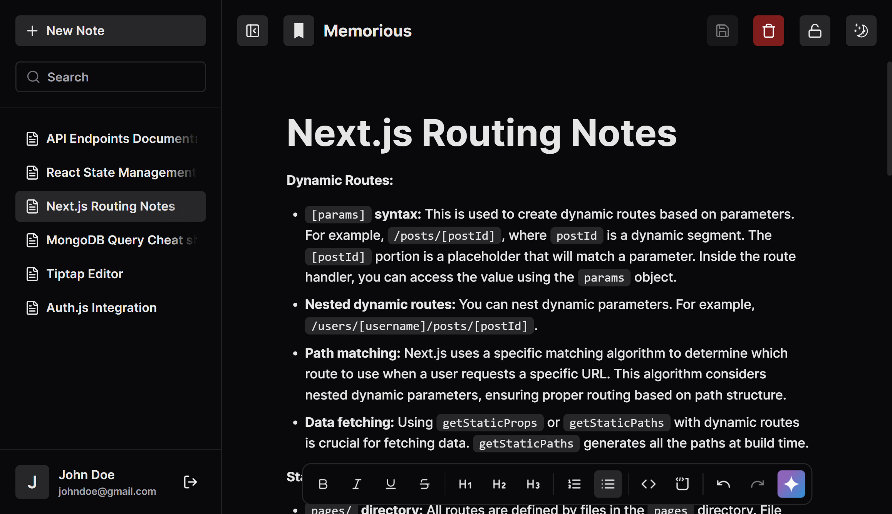

# Memorious

Memorious is a powerful note-taking application designed to help users create, save, and refine their ideas with ease. It integrates with Gemini AI to provide seamless writing assistance, making it an ideal tool for both personal and professional use.

## Features

- **Easy Note Creation**: Create, organize, and save your ideas effortlessly. Whether it's a quick thought or a detailed project, Memorious makes it simple.
- **Rich Text Editing**: Format your notes exactly the way you want. Add headings, lists, and more to make your notes stand out.
- **Simple Organization**: Keep your notes neatly organized, so you can focus on what truly matters.
- **Integrated Gemini AI**: Experience effortless note-taking with Integrated Gemini. Simply prompt, and let Gemini generate structured, detailed notes in seconds.
- **User Authentication**: Secure user authentication with email and Google login options.
- **Password Reset**: Easily reset your password with OTP verification.

## Tools and Libraries Used

- **Frontend**: React, Next.js, Tailwind CSS
- **UI Library**: Shadcn
- **Backend**: Node.js, Express.js
- **Database**: MongoDB
- **Authentication**: Auth.js with Email & Google OAuth
- **AI Integration**: Gemini API
- **Email Service**: Nodemailer
---

Thank you for checking out Memorious! If you have any questions or feedback, feel free to reach out.